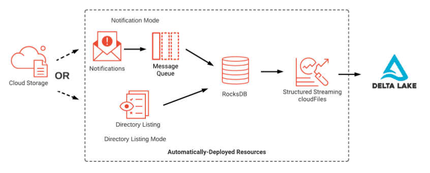

#  Databricks Data Engineer Associate
#DataEng_Roadmap/Databricks

## Topic 1: Understand how to use and the benefits of using the Databricks Lakehouse Platform and its tools
### 1 What is the *Databricks Lakehouse*?

- ACID transactions + data governance (from DWH).
- Enables BI + Machine Learning

#### 1.1 Primary Components
- **Delta tables**
    - Databricks uses the Delta Lake protocol **by default**
    - **When a Delta Table is created**:
        - Metadata is added to the *metastore* (inside the declared schema or database).
        - *Data* and *table metadata* saved to a directory.
    - All Delta Tables **have**:
        - A *Directory* containing data in **Parquet**
        - A *Sub-directory* `/_delta_log` for metadata (table versions in **Json** and **Parquet**)
- **Metastore** (is optional)
    - We can interact with tables without metastore by using **Spark APIs**

Other topics related to *Delta Tables*:
- ACID Transactions
- Data Versioning
- ETL
- Indexing

#### 1.2 Data Lakehouse vs Data Warehouse vs Data Lake
| Data Warehouse  | Data Lake  | Data Lakehouse  |
|---|---|---|
| Clean and structured data for BI Analytics  | Not for BI reporting due to its unvalidated nature  |  Low query latency and high reliability for BI/A |
|  Manage property formats | Stores data of any nature in any format  | Deals with many standard data formats  |
|   |   | ++ Indexis protocols optimized for ML and DS |

### 2 Data Science and Engineering Workspace

- For Data Analyst people -> you can use **Databricks SQL persona-based environment**

#### 2.1 Workspace
- Organize objects like *notebooks*, *libraries*, *experiments*, *queries* and *dashboards*.
- Provides access to *data*
- Provides computational resources like *clusters* and *jobs*
- Can be managed by the **workspace UI** or **Databricks REST API reference**
- You can switch between workspaces.
- You can view the **new** databricks SQL queries, dashboards and alerts. **BUT**, to view the existing ones you need to **migrate** them into the wkspace browser

#### 2.1.0 Databricks Repos
You can do the following things:
- Clone, push and pull from a remote Git repository
- Create and manage branches (development work)
- Create/edit notebooks.
- Visually compare differences upon commit 

**Databricks vs Git Provider functionaliities**
| Admin Control  | User Workflow in Databricks  | Merge workflow in Git provider  | Production job workflow in Databricks | 
|---|---|---|---|
| Setup top-level Repos (D)  | Clone remote repo (D)  | Pull request and review process (G)  | API call brings Repo in production folder to the latest version (D) | 
| Setup auto-update on merge (G)  | Create new branch (D)  | Merge into main branch (G)  | Run Databricks job based on Repo in production folder (D) | 
| | Create and edit code (D) | Git automation calls Repos API (G)  | | 
| | Commit and push code (D)  |   | | 


#### 2.2 Clusters (Databricks Computer Resource)
- Provide unified platform for many use cases: *production ETL*, *pipelines*, *streaming analytics*, *ad-hoc analytics* and *ML*.

- **Cluster Types**:
    - <ins>*All-purpose clusters*</ins>: the user can manually terminate and restart them. **Multiple users** can share such clusters (*collaborative interactive analysis*)
    - <ins>*Job clusters*</ins>: dealed by the *Databricks job scheduler*
    
- Databricks can retain cluster config for *up to 200 all-purpose clusters* terminated in the last **30 days**, and *up to 30 job clusters* **recently terminated** (you can pin a cluster to the cluster list).

Creating a Cluster
- There are to types of cluster while you create it -> Single and Multiple Node
- Photon Accelerator -> accelerate Spark workload and reduce the total cost/workload
- Termination -> default after 120 min of inactivity (can be disabled)

Editing a Cluster
- You cannot change if it was Single or Multiple Node
- If you made at least 1 change, the cluster must be restarted

Restart, Terminate and Delete a Cluster
- They all start with a **cluster termination event** (also there is a *automatic termination* due inactivity)
- Cluster terminates -> VMs/Ops Memory purged, Attached Volume deleted, Networks between nodes removed
- **Restart** -> to clear cache or to reset compute environment.
- **Terminate** -> *stop* but maintain same configurations so we can use **Restart** button to set new cloud resources.
- **Delete** -> stop our cluster and remove the configurations.

#### 2.3 Notebooks

Attach to a cluster
- Remember that a notebook provides **cell-by-cell execution of code**
- Multiple languages can be mixed inside a notebook.

Running a Cell
`CTRL+ENTER` or `CTRL+RETURN`
`SHIFT+ENTER` or `SHIFT+RETURN` -> to run the cell and move to the next one

Setting the Default Notebook Language
- Databricks notebooks support Python, SQL, Scala and R.
- You can set a PL once you are creating the notebook but can be changed at any time.
- Python is the default language. If you change it, you will see on the top of each python cell the command `%python`

Create a new cell with `B` key

Magic Commands
- Identified by `%` character
- Only 1 magic command per cell and must be the first thing in a cell.
- **Language Magics** -> `%sql`, `%python`
- **Markdown** -> for markdown language
- **Running command** -> `%run` this is to run a notebook from another notebook (its temp views and local declarations are going to be part of the calling notebook)
	- `%run ../Includes/Classroom-Setup-0.12`

Databricks Utilities (`dbutils docs`)
```python
%python
#Obtain the list of files of a path
dbutils.fs.ls(path)

#Display the list of files of a path
files = dbutils.fs.ls(path)
display(files)
```
The `display()` has the following considerations:
- Rendering plots
- Maximum 1000 records
- Has an option to download the result as a CSV file

Downloading Notebooks
1. Download a notebook
2. Download a **collection** of notebooks (using Repos)

Clearing Notebook States
* **Clear** menu and select **Clear State & Clear Outputs**

### 3 Delta Tables

3.1 Creating a Delta Table
```sql
CREATE TABLE IF NOT EXISTS students
	(	id INT, 
		name STRING, 
		gpa DOUBLE GENERATED ALWAYS AS (expression) COMMENT 'student gpa'
	);
```

3.2 Inserting Data (`COMMIT`is not required)
```sql
INSERT INTO students VALUES (1, "Yve", 1.0);
--Inserting multiple rows in 1 INSERT
INSERT INTO students
VALUES
	(4, "Ted", 4.1),
	(5, "Tiffany", 3.5),
	(6, "Vini", 4.0)
```

3.3 Querying a Delta Table
```sql
SELECT * FROM students
```
* Every `SELECT`will return the **most recent version of the table**
* Concurrent reads is limited only the **limitations** of object storage (depending on the cloud vendor).

3.4 Updating Records (1st snapshot 2nd update)
```sql
UPDATE students
SET value = value + 1
WHERE name LIKE "%T"
```

3.5 Deleting Records
```sql
DELETE students 
WHERE value > 6
```
* If you delete the entire table, you will see -1 as a result of the numbers of rows affected. This means an entire directory of data has been removed

3.6 Merge Records
```sql
MERGE INTO students s
USING students_updated u
ON s.id = u.id
WHEN MATCHED AND u.type = "update"
	THEN UPDATE SET *
WHEN MATCHED AND u.type = "delete"
	THEN DELETE
WHEN NOT MATCHED AND u.type = "insert"
	THEN INSERT *
```

3.7 Dropping Table
```sql
DROP TABLE students
```

3.8 Examining Table Details (Using the **Hive metastore**)
```sql
-- Show important metadata about our table (columns and partitioning)
DESCRIBE EXTENDED students

-- Another command is:
DESCRIBE DETAIL students
/* You can see the following information
* 	 format
* 	 table id
* 	 name & description
* 	 location
* 	 created and last modification date
* 	 partition columns, # files, size, properties
* 	 minReaderVersion and minWriterVersion
*/

-- To see the versions of a table:
DESCRIBE HISTORY students
/* You can see the following information
* 	 version #
* 	 userId and userName
* 	 operation: MERGE, DELETE, WRITE, ETC
* 	 operationParameters
*  and so on...
*/
```

3.9 Explore Delta Lake FILES
```python
%python
display(dbutils.fs.ls(f"{DA.paths.user_db}/students"))
```
* Records are stored in **parquet** files
* There is an additional directory called `_delta_log`
* This directory contains the transactions against the table.
* Even the main directory could hold more parquet files than `numFiles` indicates, the `_delta_log`helps us to know which parquet are valid
```python
# show the delta log Json file for 1 transaction
display(spark.sql(f"SELECT * FROM
json.`{DA.paths.user_db}/students/_delta_log/0000000000007.json`"))
'''
The result displays 2 important columns:
- add: list of all new files written
- remove: files that no longer should be included
'''
```

3.10 Compacting Small Files and Indexing
* `OPTIMIZE` command helps us to combine records and rewriting results 
* We can **optionally** specify the field(s) for `ZORDER`indexing.
```sql
OPTIMIZE students
ZORDER BY id

-- To query a previous version of the table
SELECT * FROM students
VERSION AS OF 3
```

3.11 Rollback Versions
```sql
RESTORE TABLE students TO VERSION AS OF 8
```

3.12 Purge Old Data Files
```sql
SET spark.databricks.delta.retentionDurationCheck.enabled = false;
SET spark.databricks.delta.vacuum.logging.enabled = true;

VACUUM students RETAIN 0 HOURS DRY RUN
--DRY RUN: to print out all records to be deleted
```

## Topic 2: Build ETL pipelines using Apache Spark SQL and Python
### 1. Relational Entities

#### 1.1 Creating a Schema
```sql
-- Method 1: without a location
CREATE SCHEMA IF NOT EXISTS ${da.db_name}_default_location;
-- It will store under dbfs:/user/hive/warehouse (with .db extension)

CREATE SCHEMA IF NOT EXISTS ${da.db_name}_custom_location LOCATION ‘${da.paths.working_dir}/_custom_location.db’;
```

You can check the information of the schema with `DESCRIBE SCHEMA EXTENDED …`

#### 1.2 Example using a schema
```sql
USE ${da.db_name}_default_location;

CREATE OR REPLACE TABLE example_table (width INT, length INT, height INT);

DESCRIBE DETAIL example_table;
/* 
it will store in:
dbfs:/user/hive/warehouse/schema_name.db/example_table
*/
```

Displaying the list of files of the table
```python
hive_root 	= f”dbfs:/user/hive/warehouse”
db_name		= f”{DA.db_name}”_default_location.db”
table_name 	= f”example_table”

tbl_location = f”{hive_root}/{db_name}/{table_name}”
print(tbl_location)

files 		= dbutils.fs.ls(tbl_location)
display(files)
```

If you **drop the table** the files will be deleted but the **schema remains**.

### 2. Tables
First, we need to know the difference between *managed* and *unmanaged* tables
- **Unmanaged Tables**: 
	- Spark only manages the metadata and we control the data location
	- A table is considered unmanaged if we add `path` option
	- If we drop the table, **only the metadata will be dropped**
	- Global -> available across all clusters
- **Managed Tables**:
	- Spark manages both data and metadata.
	- Global -> available across all clusters
	- If we drop the table, **both data and metadata will be dropped**

```sql
USE ${da.db_name}_default_location

-- external table
CREATE OR REPLACE TEMPORARY VIEW temp_delays USING CSV OPTIONS (
	path 	= ‘${DA.paths_datasets}/flights/departuredelays.csv’,
	header	= ‘true’,
	mode 	= “FAILFAST” —-abort file parsing with RuntimeException  
);

CREATE OR REPLACE TABLE external_table LOCATION ‘{da.paths.working_dir}/external_table’ AS SELECT * FROM temp_delays;
```

- You can uso `SHOW TABLES` to list all tables

#### 2.1 Views
```sql
CREATE VIEW view_delays_abq_lax AS
	SELECT *
	FROM external_table
	WHERE origin = ‘ABQ’ AND destination = ‘LAX’;
```
- The view will appear in the `SHOW TABLES` result.

```sql
-- TEMPORARY VIEWS
CREATE TEMPORARY VIEW temp_view_delays
AS
SELECT * 
FROM external_table 
WHERE delay > 120 ORDER BY delay ASC;
```
- `SHOW TABLES` will show that the temporary view has the isTemporary flag as true but is not assigned to a database.

```sql
-- GLOBAL VIEWS
CREATE GLOBAL TEMPORARY VIEW temp_view_delays_gt
AS
SELECT * 
FROM external_table 
WHERE distance > 1000;
```
- To display the global views, you should type `SHOW TABLES in global_temp` because all global views are stored in the `global_temp` database.

**Considerations**:
- Temp vies are **tied** to a Spark Session, that means that are not accessible:
	- After restarting a cluster
	- After detaching and reattaching a cluster
	- After installing a python package (python interpreter restarts)
	- Using another notebook
- For **global** views, the cluster holds the `global_temp` database .

#### 2.2 Common Table Expression (CTEs)
```sql
-- Example 1
WITH temp_table (
	temp_column_1,
	temp_column_2,
	temp_column_3,
) AS (
	SELECT
		column_1,
		column_2,
		column_3
	FROM 
		source_table
)
SELECT *
FROM
	temp_table
WHERE
	temp_column_1 > 1;
```

```sql
-- Example 2
WITH final_temp_table AS
(
	WITH temp_table (
		temp_column_1,
		temp_column_2,
		temp_column_3,
	) AS (
	SELECT
		column_1,
		column_2,
		column_3
	FROM 
		source_table
	)
	SELECT *
	FROM
		temp_table
	WHERE
		temp_column_1 > 1
)
SELECT count(temp_column_1) AS ‘Total’ FROM final_temp_table;
```

```sql
-- Example 3
SELECT max(temp_column_1), min(temp_column_1)
FROM
(
	WITH temp_table (temp_column_1) AS (
	SELECT
		column_1
	FROM 
		source_table
	)
	SELECT temp_column_1 FROM temp_table
)
```

```sql
-- Example 4
SELECT
	(
		WITH distinct_source_table AS (
			SELECT DISTINCT origin_column FROM source table
		)
		SELECT
			count(origin_column) as ‘Total’
		FROM
			distinct_source_table
	)	AS ‘Number’
```

```sql
-- Example 5 (with CREATE VIEW)
CREATE OR REPLACE VIEW view_table
AS 
WITH origin_table(temp_column_1, temp_column_2)
	AS (SELECT column_1, column_2 FROM source_table)
	SELECT * FROM source_table
	WHERE column_1 > 100;
```

### 3. ETL Processes

#### 3.1 Querying Files
```sql
-- Querying a Single File
SELECT * FROM file_format.`/path/to/file`;

/* 
* Querying a Directory
* Consideration: the directory must have files with the same
* format and schema
*/
SELECT * FROM file_format.`/path/to/`
```
- You can read json files put in `file_format` as `json`
- There are some cases when the files lacks of standardization, so reading the files as json would not fit. In that case we can use `text` as the file format.
- If you are dealing with images or unstructured data, you can use `binaryFile` as file format. 

#### 3.2 Creating References to Files
```sql
CREATE OR REPLACE TEMP VIEW temp_view
AS SELECT * FROM json.`/path/to/`;
```

#### 3.3 Registering Tables on External Data with Read Options
```sql
CREATE TABLE sales_csv
(order_id LONG, email STRING, transactions_timestamp LONG)
USING CSV
OPTIONS (
	header 		= "true",
	delimiter	= "|"
)
LOCATION "${DA.paths.sales_csv}"
```

You can specify the following:
- The column types
- The file format
- The delimiter used
- The presence of a header
- The location of the files

*There is no data movement*
- The metadata and options passed during table declaration will be persisted to the metastore.
- It’s **important** to not change the column order (there’s no schema enforcement)
- To refresh the cache of our data, we can use `REFRESH TABLE table_name`

#### 3.4 Extracting Data from SQL Databases
```sql
CREATE TABLE table_jdbc
USING JDBC
OPTIONS (
	url = "jdbc:sqlite:${DA.paths.ecommerce_db}",
	dbtable = "table",
	user = "user_name",
	password = "password"
)
```
- The table has been listed as `MANAGED` so there is no data stored in the dbfs.
- Could exist some significant overhead because of either:
	- Network transfer latency
	- Execution of query logic in source systems not optimized for big data queries.
	
#### 3.5 Creating Delta Tables
```sql
-- as SELECT
CREATE OR REPLACE TABLE sales AS
SELECT * FROM
parquet.`${da.paths.datasets}/ecommerce/raw/sales-historical`
-- Here we are using a infer schema information

-- When the infer schema is not correctly processed
CREATE OR REPLACE TEMP VIEW sales_temp_view
(order_id LONG, email STRING, transactions_timestamp LONG, ...)
USING CSV
OPTIONS (
	path 		= "${da.paths.datasets}/ecommerce/raw/sales-csv",
	header 		= "true",
	delimiter	= "|"
);

CREATE TABLE sales AS
	SELECT * FROM sales_temp_view;
```

```sql
-- Renaming columns
CREATE OR REPLACE TABLE purchases AS
SELECT order_id AS id, transaction_timestamp, purchase_revenue_in_usd AS price
FROM sales;
```

```sql
-- Declaring schema and making comments
CREATE OR REPLACE TABLE purchase_date (
	id STRING,
	transaction_timestamp LONG,
	price STRING,
	date DATE GENERATED ALWAYS AS (
		cast(cast(transaction_timestamp/1e6 AS TIMESTAMP) AS 	DATE))
	COMMENT "generated based on `transactions_timestamp` column"
	) 
)
```

```sql
-- Adding constraints (2 types: NOT NULL and CHECK)
ALTER TABLE purchase_dates ADD CONSTRAINT valid_date CHECK (date > '2020-01-01');
-- This is store in the TBLPROPERTIES field

--Using data quality checks

--If record violates then drop row on dataset
ALTER TABLE purchase_dates ADD CONSTRAINT valid_date EXPECT(date > '2020-01-01') ON VIOLATION DROP ROW;
--If record violates then job will fail
ALTER TABLE purchase_dates ADD CONSTRAINT valid_date EXPECT(date > '2020-01-01') ON VIOLATION FAIL UPDATE;
```

```sql
-- A more complex example
CREATE OR REPLACE TABLE users_pii
COMMENT "Contains PII"
LOCATION "${da.paths.working_dir}/tmp/users_pii"
PARTITIONED BY (first_touch_date)
AS
	SELECT *,
		cast(cast(user_first_touch_timestamp/1e6 AS TIMESTAMP)
		AS DATE) first_touch_date,
		current_timestamp() updated,
		input_file_name() source_file
	FROM parquet.`${da.paths.datasets}/ecommerce/raw/users-historical/`;
```

#### 3.6 Cloning Delta Lake Tables
```sql
-- Option 1: DEEP CLONE (copies data and metadata, this is incremental)
CREATE OR REPLACE TABLE purchases_clone
DEEP CLONE purchases
```

```sql
-- Option 2: SHALLOW CLONE (copies Delta transactions logs)
CREATE OR REPLACE TABLE purchases_clone
SHALLOW CLONE purchases
```

#### 3.7 Writing to Delta Tables

Overwriting
- Some benefits of **overwriting** data:
	- Is much faster because you will not list the directories recursively.
	- You can use *Time Travel* to retrieve old data.
	- It’s an atomic operation -> concurrent queries can read the data while you are deleting the table
	
```sql
-- Option 1: Using CRAS
CREATE OR REPLACE TABLE table AS
SELECT * FROM parquet.`path/file`;

-- If you want to check the previous states you can use:
DESCRIBE HISTORY table;

-- CRAS helps us to redefine the structure of the table
```

```sql
-- Option 2: Using INSERT OVERWRITE
INSERT OVERWRITE table
SELECT * FROM parquet.`path/file`;

-- If you want to check the previous states you can use:
DESCRIBE HISTORY table;

-- It will fail if we try to change the schema of the table
```

Appending
```sql
INSERT INTO table
SELECT * FROM parquet.`path/file`;
```

Merging Updates
```sql
MERGE INTO table a
USING source b
ON {merge_condition}
WHEN MATCHED THEN {matched_action}
WHEN NOT MATCHED THEN {not_matched_action}
```
- Common use case: to insert not duplicate records.

Copying incrementally
```sql
COPY INTO sales
FROM `path/file`
FILEFORMAT = PARQUET;
```

#### 3.8 Cleaning Data

Inspecting Data
```sql
-- Using count
SELECT 
	count(column_1) AS count_column_1,
	count(column_2) AS count_column_2,
	count_if(column_1 IS NULL) AS count_if_column_1
FROM
	table_name;

-- Using distinct
SELECT count(DISTINCT(*)) FROM	table_name;
SELECT count(DISTINCT(column_1)) FROM	table_name;
```

```sql
-- Validation of datasets (similar like CASE WHEN)
SELECT max(row_count) <= 1 no_duplicate_id FROM (
	SELECT column_1, count(*) AS row_count
	FROM table_name
	GROUP BY column_1
);
```

Date Format and Regex
```sql
SELECT *,
	date_format(date_column, “MMM d, yyyy”) AS formatted_date,
	date_format(date_column, “HH:mm:ss”) as formatted_time,
	regexp_extract(email_column, “(?<=@).+”,0) as email_domain
FROM (
	SELECT *,
		CAST(date_column_num / 1e6 AS timestamp) AS date_column
	FROM table_name
);
```

#### 3.9 Advanced SQL Transformations

Casting to string: for cases of having binary-encoded JSON values
```sql
CREATE OR REPLACE TEMP VIEW events_string AS
SELECT string(key), string(value)
FROM events_raw;
```

For data stored as string but has a dictionary format
```sql
SELECT value:element1, value: element2
FROM events_string;
```
You can use it also on the `WHERE` statement.

Using `schema_on_json`
```sql
CREATE OR REPLACE TEMP VIEW parsed_events AS
SELECT 
from_json(original_column,schema_on_json('{
"device":"MacOS",
"ecommerce":{
	"purchase_revenue_in_usd": 1075.5,
	"total_item_quantity": 1,
	"unique_items": 1,
},
"items":[
{"coupon":"NEWBED10", "item_id":"M_STAN_K","price_in_usd":29.9}
],
"user_id": "123456"
}')) AS json
FROM events_string;

-- You can read the info like this
CREATE OR REPLACE TEMP VIEW parsed_events_final AS
SELECT 
	json.*
FROM
	parsed_events;
```
- This helps to provide a schema to a json column that has some sub-elements empty and you can define a sub-schema for them.

Exploring Data Structures

**Struct**
```sql
-- Reading fields from a STRUCT field
SELECT 
	ecommerce.purchase_revenue_in_usd,
	ecommerce.total_item_quantity
FROM parsed_events_final
WHERE
	ecommerce.purchase_revenue_in_usd > 199.99;
```

**Arrays**
```sql
-- Reading fields from ARRAY field
SELECT *
FROM parsed_events_final
WHERE size(items) > 2;

-- Using Explode
SELECT
	user_id,
	device,
	explode(items) AS item
FROM parsed_events_final
WHERE size(items) > 2;
```

*Remember*:
- `collect_set`: collect unique values for a field.
- `flatten`: multiple arrays can be combined into a single array
- `array_distinct`: removes duplicate elements from an array
*Use them on aggregations*

```sql
SELECT
	user_id,
	collect_set(event_name) as event_history,
	array_distinct(flatten(collect_set(items.item_id))) AS cart_history
FROM parsed_events_final
GROUP BY
	user_id
```

Join Tables
```sql
CREATE OR REPLACE VIEW sales_enriched AS
SELECT *
FROM (
	SELECT *, explode(items) AS item
	FROM sales
) a
INNER JOIN item_lookup b
ON a.item.item_id = b.item_id;
```

Set Operators
Not too much to mention, if you have some experience with SQL you may know `UNION`, `INTERSECT` and `MINUS`.

Pivot Tables
```sql
CREATE OR REPLACE TABLE transaction AS
SELECT * FROM (
	SELECT
		email,
		order_id,
		transaction_timestamp,
		item.item_id AS item_id,
		item.quantity AS quantity
	FROM sales_enriched
)	PIVOT (
	sum(quantity) FOR item_id IN (
		'P_FOAM_K',
		'M_STAN_Q',
		'P_FOAM_S',...
	)
)
);
```

Higher Order Functions
**Filter**
Given a lambda function, we can make some filters inside an array
```sql
SELECT
	order_id,
	items,
	FILTER(items, i -> i.item_id LIKE "%K") AS king_items
FROM sales
```

**Transform**
Given a lambda function,  transform all elements in an array
```sql
CREATE OR REPLACE TEMP VIEW king_item_revenues AS
SELECT
	order_id,
	TRANSFORM (
		items,
		k -> CAST(k.item_reveneu_in_usd * 100 AS INT)
	) AS item_revenues
FROM king_size_sales;
```

Other operations that were not covered (with examples) on the Databricks Learning Notebooks are `reduce` and `exists`.

#### 3.10 SQL UDFs
```plsql
CREATE OR REPLACE FUNCTION yelling(text STRING)
RETURNS STRING
RETURN concat(upper(text),"!!!")

SELECT yelling(food) FROM foods;
```

- SQL UDFs persists between execution environments (notebooks, DBSQL queries and jobs).
- You can view a detail of the function with `DESCRIBE FUNCTION function`.
- To see the body of the function you can use `DESCRIBE FUNCTION EXTENDED function`.
- To use SQL UDF, **a user must have `USAGE`and `SELECT` permissions**.

```plsql
CREATE FUNCTION foods_i_like(food STRING)
RETURNS STRING
RETURN CASE
	WHEN food = "beans" THEN "I love beans"
	...
	ELSE concat("I don't eat ", food)
END;
```

### 3. Some Functions with Python
```python
# Creating a database
def create_database(name_db, reset_db=True):
	import re # to clean the username
	username = spark.sql("SELECT current_user()").first()[0]
	clean_username = re.sub("[^a-zA-Z0-9]","_",username)
	db_name_final = f"{clean_username}_{name_db}"
	working_dir = f"dbfs:/user/{username}/{name_db}"
	
	# displaying the info
	print(f"username: 		{username}")
	print(f"dbname: 		{db_name_final}")
	print(f"working_dir: 	{working_dir}")

	# if reset is True we drop the DB an re-create it
	if reset:
		spark.sql(f"DROP DATABASE IF EXISTS {db_name_final} CASCADE")
		dbutils.fs.rm(working_dir, True)
	
	spark.sql(f"CREATE DATABASE IF NOT EXISTS {db_name_final} LOCATION '{working_dir}/{db_name_final}.db'")
	spark.sql(f"USE {db_name_final}")

# calling the function
create_database("luism_database")
```

```python
# Python method for displaying query results

def query_or_make_demo_table(table_name):
	try:
		display(spark.sql(f"SELECT * FROM {table_name}"))
		print(f"Displayed results for the table {table_name}")
	except:
		spark.sql(f"CREATE TABLE {table_name} (id INT, name STRING, value DOUBLE, state STRING")
		spark.sql(f"""INSERT INTO {table_name}
					   VALUES (....)
					""")
		display(spark.sql(f"SELECT * FROM {table_name}"))
		print(f"{table_name} created") 
```

## Topic 3: Incrementally process data
### 1 General Concepts
- *Incremental ETL* allow us to deal with new data that has been encountered after the last ingestion
- *Databricks Auto Loader* provides a mechanism for incrementally and efficiently processing from data that come from a Cloud Storage. Also it can split the processing into batches so its less expensive.



#### 1.1 Auto Loader parameters
- We can use the following parameters if the *automatic schema inference and evolution* is active.

| Argument  | Description  | How to use it  |
|---|---|---|
|  `data_source` |  Source data directory  |  `.load()` |
|  `source_format` |  Source data format |  if comes from cloudFiles should be `cloudFiles.format` |
|  `table_name` |  Table name |  `.table()` |
|  `checkpoint_directory` |  Location where to store metadata of the stream |  `option("checkpointLocation",checkpoint_directory)` |

```python
def autoload_to_table(data_source,source_format, table_name, checkpoint_directory):
	query = (
			spark.readStream
				.format("cloudFiles")
				.option("cloudFiles.format", source_format)
				.option("cloudFiles.schemaLocation",checkpoint_directory)
				.load(data_source)
				.writeStream
				.option("checkpointLocation",checkpoint_directory)
				.option("mergeSchema","true")
				.table(table_name)
	)

	return query
```

```python
query = autoload_to_table(data_source,"json","target_table",f"{DA.paths.checkpoints}/target_table")
```
- This code seems that it is not finishing, this is because it is a **continuously active query**

#### 1.3 Describing the Target Table
```sql
DESCRIBE EXTENDED target_table;
```
There is a column called **_rescued_data** that helps to record the data that could be malformed and not fit on the table.

### 2 Reasoning of Incremental Streaming
- In Databricks, a Data Stream can be treated as a **unbounded table**. That means that if we have new data in the stream they become new rows appended on the table.
- *Data Stream* receives data from different sources that can be:
	- A new JSON log
	- CDC feed
	- Events queued in a pub/sub messaging feed
	- CSV file from previous day

#### 2.1 Basic Components
- **Input table**
- **Query** -> can be made in Dataframes API or Spark SQL
- **Results Table** -> Holds the incremental state information of the stream
- **Output** -> Will persist updates from the result table using a *sink* (this works as dfs of files or pub/sub messages bus)
- **Trigger Interval**

#### 2.2 End-to-end Fault Tolerance
- This approach works only if *the sources are replayable* (cloud-based storage object or pub/sub messaging service)
- Works like this (*Checkpointing* and *Idempotent Sinks*):
	- **First**, the Structured Streaming uses *checkpointing* and *write-ahead logs* -> they record the offset range of data 
	- **Then**, the Streaming Sink can receive multiple writes from the same offset but we will be sure that data is not going to be duplicated (*idempotent*)

#### 2.3 Reading a Stream
```python
(spark.readStream #returns a DataStreamReader 
		.table("bronze")
		.createOrReplaceTempView("streaming_tmp_vw"))
```

How to stop a stream with python
```python
for s in spark.streams.active:
	print("Stopping " + s.id)
	s.stop()
	s.awaitTermination()
```

**You cannot use some operations like ORDER BY on a streaming view**

#### 2.4 Writing a Stream
- Settings:
	- Checkpointing -> stores the current state of the streaming job and cannot be shared between separate streams
	- Output Modes
		- `append` ->**default**
		- `complete` -> result table is **recalculated** each write triggered (target table is overwritten)
	- Trigger Intervals
		- Unspecified -> **default** 500ms
		- Fixed interval micro-batches -> `processingTime = "2 minutes"`
		- Triggered micro-batch -> `once=True`
		- Triggered micro-batched -> `availableNow = True`

```python
spark.table("device_counts_tmp_vw")
		.writeStream
		.option("checkpointLocation", "location_path/silver")
		.outputMode("complete")
		.trigger(availableNow=True)
		.table("device_counts")
		.awaitTermination() #optional: blocks execution
```

When to use AUTOLOADER and COPY INTO

| Context  | Auto Loader  | COPY INTO  |
|---|---|---|
| Ingest files in order of thousands  |    |  X  |
| Ingest files in order of millions  |  X  |    |
| Data Schema Evolution |  X  |    |
| Re-upload a subset |    |  X  |
| File notification | | X |
| Directory listing | X | X |

### 3 The Multi-hop Architecture
**Insert image of  the multi-hop architecture**

#### 3.1 Layers
- Bronze Layer: holds the raw data from various sources
- Silver Layer: holds some refined data from the bronze layer. We can make joins and create other columns
- Gold Layer: tables with business-level aggregates for visualization and dashboarding.

#### 3.2 Bronze
```python
# Reading the data Stream
spark.readStream
		.format(“cloudFiles”)
		.option(“cloudFiles.format”,”json”)
		.option(“cloudFiles.schemaHints”,”time DOUBLE”)
		.option(“cloudFiles.schemaLocation”,”/path/bronze”)
		.load(data_landing_location)
		.createOrReplaceTempView(“recording_raw_temp”)
```

```sql
/* Creating a temp view with more metadata */
CREATE OR REPLACE TEMPORARY VIEW recordings_bronze_temp AS (
	SELECT 
		* , 
		current_timestamp() as receipt_time,
		input_file_name() source_file
	FROM
		recording_raw_temp
)
```

```python
# Writing the data into a Delta Table
(spark.table(“recording_bronze_temp”)
		.writeStream
		.format(“delta”)
		.option(“checkpointLocation”,”/path/bronze”)
		.outputMode(“append”)
		.table(“bronze”)
```

#### 3.3 Silver
```python
# Reading the stream that comes from the Bronze Layer
(
spark.readStream
	.table(“bronze”)
	.createOrReplaceTempView(“bronze_temp”)
)
```

```sql
/* Making additional modifications on the table */
CREATE OR REPLACE TEMPORARY VIEW recordings_join AS (

	SELECT
		a.column_1,
		a.column_2,
		cast(from_unixtime(time, ‘yyyy-MM-dd HH:mm:ss’) AS timestamp) time, a.column_3
	FROM	
		bronze_temp a
	JOIN
		join_table b
	ON	a.key_column = b.key_column
	WHERE
		b.column_5 > something
)
```

```python
# Loading the table to silver hop
(
spark.table(“recordings_join”)
		.writeStream
		.format(“delta”)
		.option(“checkpointLocation”,”/path/recordings_enriched”)
		.outputMode(“append”)
		.table(“recordings_enriched”)
)
```

#### 3.4 Gold
```python
# Reading stream from the silver hop
(
spark.readStream
		.table(“recordings_enriched”)
		.createOrReplaceTempView(“recordings_enriched_temp”)
)
```

```sql
/* Making the aggregations based on bussines needs */
CREATE OR REPLACE TEMP VIEW recording_agg AS (
	SELECT column_1, column_2, mean(column_3) avg_column_3
	FROM recordings_enriched_temp
	GROUP BY column_1, column_2
)
```

```python
(
spark.table(“recordings_agg”)
		.writeStream
		.format(“delta”)
		.outputMode(“complete”)
		.option(“checkpointLocation”,”/path/daily_agg”)
		.trigger(availableNow = True)
		.table(“daily_recordings_agg”)
)
```

### 4 Delta Live Tables

#### 4.1 Delta Live Tables UI
For this part, we need to create and configure a **pipeline**. On the Databricks Learning Notebooks you will find the steps to create a workflow.

Some important fields that we need to set:
- Product edition: `Core`,`Pro` and `Advanced`
- Pipeline name
- Notebook libraries
- Configuration
	- `spark.master` -> `local[*]`
	- `dataset_path` -> `dbfs:/......`
- Target: means the database name
- Storage Location
- Pipeline mode:
	- `Triggered` -> update once and the cluster shuts down
	- `Continuous` -> keep a cluster always running
- Cluster mode:
	- `Legacy autoscaling` -> let you to put min and max workers
	- `Enhanced autoscaling`
	- `Fixed Size` -> let you to put a fixed number of workers

#### 4.2 Looking inside a Notebook that run inside a job

*Bronze Layer*
- Via Auto Loader requires to use `STREAMING`
- `cloud_files()`enables **Auto Loader**
```sql
CREATE OR REFRESH STREAMING LIVE TABLE table_raw
COMMENT "Table with the raw elements"
AS SELECT * FROM 
cloud_files("/path/dataset","json",map("cloudFiles.inferColumnTypes","true"))

# Parameters:
# - source_location
# - source data format
# - map: to add options
```

*Silver Layer*
- Here we can add some **quality control** like constraints.
- To refer a DLT table we have to use `live` this helps us when we change the environment the migration would be easy.
- To refer streaming tables we have to use `STREAM()`.
```sql
CREATE OR REFRESH STREAMING LIVE TABLE table_cleaned(
CONSTRAINT valid_element_id EXPECT (element_id IS NOT NULL) ON VIOLATION DROP ROW
)
AS
SELECT
	-- make some transformations on columns
FROM
	STREAM(LIVE.table_raw) f
JOIN
	LIVE.other_table_raw g
ON
	f.element_id = g.element_id
```

*Gold Layer*
```sql
CREATE OR REFRESH LIVE TABLE table_final
AS
SELECT
	-- some proccessing here + aggregations
FROM
	table_cleaned
WHERE
	-- some filter
GROUP BY
	-- some aggregations
```

#### 4.3 Using Databricks Jobs to Orchestrate Tasks
After we set our delta live table we can schedule (*Cron* or *On Demand* run) it via Databricks Jobs. The most important information to fill on the Job Form are the following.
- Task name
- Type: notebook, python script, python well, sql, etc.
- Source: Workspace and Git
- Path: location of the notebook
- Cluster
- Retries? -> You can add a retry policy (1 time means 2 attemps in total and so on)

**Remember that jobs and queries are hosted in the CONTROL PLANE**

About the schedule:
- You can select like: Every `Minute/Hour/Day/Week/Month` at `H24:MM` `TimeZone`

### 5 Navigating Databricks SQL
- To access SQL Warehouse, you need to go to SQL Workspace
- You can create a SQL Warehouse with an specific cluster size
- You can import a Sample Database to your SQL Warehouse

**Creating a Query**
- On the Query section, you can attach your SQL Warehouse and make your queries and store them

**Updating a Dashboard**
- On the Dashboard section, you can attach your SQL Warehouse and select a type of visualization element (chart, etc) and attach a Query.

**Set a Query Refresh Schedule**
- On the SQL Query editor you can schedule the refresh execution of a query table.

## Topic 4: Understand and follow best security practices
### 1 Data Explorer
- You can find it on Data or Data Explorer sections
- Helps you with
	- Navigate databases, tables, views
	- Explore data schema, metadata and history
	- Set and modify **permissions** of relational entities

#### 1.1 Configuring Permissions
- By default only admins can view all objects registered to the metastore (users by default don’t have the permissions)

**Table ACLS**
- `CATALOG` -> control access to the entire data catalog
- `DATABASE`
- `TABLE` -> managed or external tables
- `VIEW`
- `FUNCTION`
- `ANY FILE`

**Granting Privileges** (Roles)
- Databricks administrator
- Catalog owner
- Database owner
- Table owner

**Privileges**
- `ALL PRIVILEGES`
- `SELECT`
- `MODIFY`
- `READ_METADATA`
- `USAGE` -> don’t give any permission but is an additional requirement to perform any action on a db object
- `CREATE`
- `CREATED_NAMED_FUNCTION`

#### 1.2 Giving grant  to Derivative datasets
```sql
CREATE DATABASE database_name;
GRANT USAGE, READ_METADATA, CREATE, MODIFY, SELECT ON DATABASE `database_name` TO `users`;

-- Display grants
SHOW GRANT ON DATABASE `database_name`;
```

#### 1.3 Give grant to create databases and tables
```sql
GRANT USAGE, CREATE ON CATALOG `hive_metastore` TO `users`;
```

#### 1.4 Change owner of a table
```sql
GRANT OWNER ON table_name TO 'group';
```