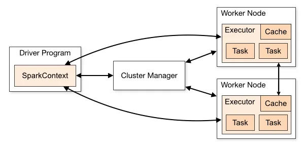
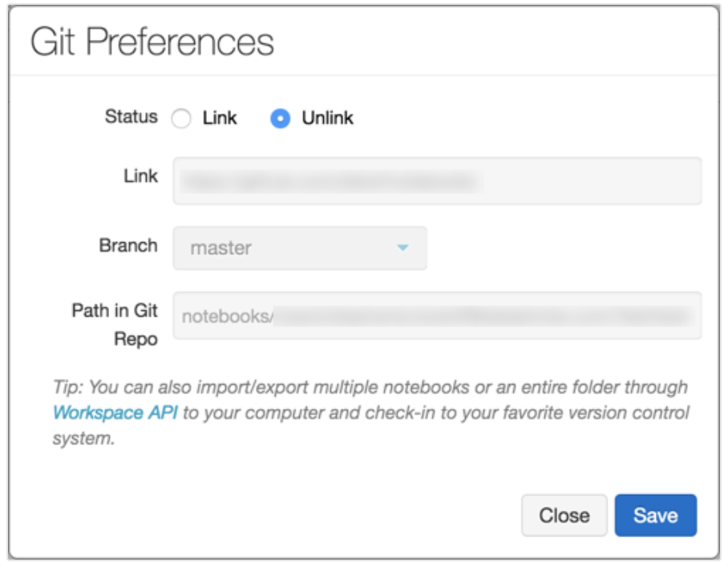

#  Databricks Data Engineer Professional Cheatsheet (In Progress)

## **Topic 1: Understand how to use and the benefits of using the Databricks platform and its tools**

<h3 style="font-weight:bold;"> a. Platform </h3>
<h4 style="font-style:italic;"> a.1. Notebooks </h4>

<ins>Capabilities<ins>

- Programming Languages: *Python*, *SQL*, *Scala* and *R*.
- Export as `.html` or `.ipynb`.
- Environment customization.
- Scheduled jobs with multi-notebook workflows.
- Integration with Git-based repository.
- Build/Share dashboards
- Run **Delta Live Tables** pipeline

<ins>Notebooks Management<ins>

**Link**: https://docs.databricks.com/notebooks/notebooks-manage.html

- New(+) / Notebook
- For Control Access: **Premium Plan or above** (Workspace access level)
    - No Permissions
    - Can Read -> View Cells + Comment + use `%run`/workflows
    - Can Run -> Attach/Detach
    - Can Edit -> Edit Cells
    - Can Manage -> Change Permissions
- To review Notebooks attached to a cluster: **Cluster Page**/*Notebooks* tab

<ins> Coding in Notebooks<ins>

**Link**: https://docs.databricks.com/notebooks/notebooks-code.html

- You can change the default language
- You can override the language to execute on each cell.
- *Some magic commands:*
    - `%sh`: run shell code (`-e` to fail a cell if non-zero exit status). It runs only on the **Apache Spark driver** (not the workers).
    - `%fs`: to use the `dbutils` filesystem commands
    - `%md`: for markdown
    - `%pip`: python libraries installation
      - Remember that every time you are running this command, **the python interpreter will be restarted**
- A SQL result are automatically available as Python DataFrame (`_sqldf`)
    - Databricks Runtime 13.0 (and above) support **IPython's output caching system**
- Variables defined in one language (and hence in the REPL for that language) are not available in the REPL of another language.


*Package Cells*: is a cell that is compiled when it is run. (Scala)

<ins>Notebook Outputs<ins>

**Link**: https://docs.databricks.com/notebooks/notebook-outputs.html

- Results maximum 10,000 rows (2 MB)
- If your notebook exceeds 20 MB in total, you will get an error (maybe caused by multiple `display()`).

<ins>Scheduled Notebook Jobs<ins>

**Link**: https://docs.databricks.com/notebooks/schedule-notebook-jobs.html

- If you don't allow the creation of a new cluster after triggering job, Databricks will used the current cluster the notebook is attached to.

<ins>Collaborate using Databricks notebooks<ins>

**Link**: https://docs.databricks.com/notebooks/notebooks-collaborate.html

<ins>Export/Import Notebooks<ins>

- Source File: .scala, .py, .sql, .r
- HTML
- .dbc (Databricks archive)
- Jupyter notebook (.ipynb)
- RMarkdown (.Rmd)

<ins>Test Databricks notebooks <ins>

**Link**: https://docs.databricks.com/notebooks/test-notebooks.html

- You can use the built-in Python `unittest` package
- Using Databricks widgets
- Schedule tests to run automatically (with email notification)
- Using Databricks Repos:
Example:

```python
%sh

pwd
ls
python -m unittest -v shared_test.py
```

<ins>Python environment management<ins>

**Link**: https://docs.databricks.com/libraries/index.html#notebook-scoped-libraries

<ins>Databricks Widget<ins>

**Link**: https://docs.databricks.com/notebooks/widgets.html

*4 Types:*
- `text`: input a value in a text box.
- `dropdown`
- `combobox`
- `multiselect`

```python
dbutils.widgets.dropdown("database", "default", [database[0] for database in spark.catalog.listDatabases()])
dbutils.widgets.text("table", "")
```

```sql
SHOW TABLES IN ${database};

SELECT *
FROM ${database}.${table}
LIMIT 100;
```

```python
# Get a widget variable
dbutils.widgets.get("database")

# Remove widget variable
dbutils.widgets.remove("database")
dbutils.widgets.removeAll()
```

*Considerations*:
- Cannot use widgets to pass arguments between different languages (only when you click on Run All).

*Configure Widget Settings*:
- **Run Notebook**: new value, entire notebook is rerun.
- **Run Accessed Commands**: new value, cells that return that widget are rerun
- **Do Nothing**

*Running a Notebooks with widgets*
```bash
%run /path/to/notebook $X="10" $Y="1"
```

<ins>Run a Notebook from another notebook<ins>

**Link**: https://docs.databricks.com/notebooks/notebook-workflows.html

```bash
%run ./shared-code-notebook
```
or
```python
# on calle notebook
dbutils.notebook.exit("returnValue")

# on caller notebook
returnValue = dbutils.notebook.run("notebook-name",60, {"argument":"data",...})
```
fancy way to handle errors
```python
# Errors throw a WorkflowException.

def run_with_retry(notebook, timeout, args = {}, max_retries = 3):
  num_retries = 0
  while True:
    try:
      return dbutils.notebook.run(notebook, timeout, args)
    except Exception as e:
      if num_retries > max_retries:
        raise e
      else:
        print("Retrying error", e)
        num_retries += 1

run_with_retry("LOCATION_OF_CALLEE_NOTEBOOK", 60, max_retries = 5)
```

<h4 style="font-style:italic;"> a.2. Clusters </h4>

**Link**: https://docs.databricks.com/clusters/configure.html

<ins>Cluster Access Mode (Not supported in Clusters API)<ins>

- Single User
- Shared
    - credential passthrough is not supported.
    - spark-submit not supported
    - cannot use UDFs
- No Isolation Shared
- Custom 

<ins>Cluster Node Type<ins>

- Driver Node
    - maintains state information of all notebooks attached
    - maintains the **SparkContext**
    - coordinates with the Spark executors.
- Worker Node

<ins>Permissions<ins>

- **Can Attach To**: Attach notebook to cluster, view Spark UI, cluster metrics and driver logs.
- **Can Restart**: Terminate, start and restart cluster.
- **Can Manage**: Edit cluster, attach library to cluster, resize cluster, modify permissions.

<ins>Autoscalling<ins>

- Not available for `spark-submit`.
- Customize the "scale down" with `spark.databricks.aggressiveWindowDownS`

<ins>Other considerations<ins>

- *After editing a cluster*, all the notebooks/jobs remain attached.
- *After editing a cluster*, libraries remain installed.
- Only **running**/**terminated** clustes can be edited.
- *Cloning a cluster* doesn't clone the **cluster permissions**,**installed libraries** and **attached notebooks**.
- *When restarting a cluster*, Databricks re-creates the cluster with the same ID, automatically installs the libraries and reattaches the notebooks.
- *Cluster information* through **Apache Spark UI**
    - Cluster logs (event logs (60 days retention), driver/worker log (**Standard output**, **standard error**, **Log4j logs**), init-script logs)
    - Monitoring performance: *Ganglia* (refreshed every 15 minutes) or *Datadog*

<ins>Cluster features<ins>

- 2 types: *All-purpose* and *job* clusters
    - *All-purpose*: shared by multiple users.
    - *Job*: terminate when your job ends.
- Cluster modes: *Multi Node* and *Single Node*
- Pools: reduce cluster start and scale-up by maintaining a set of available instances (reduce cost).

<h4 style="font-style:italic;"> a.3. Jobs </h4>

**Link**: https://docs.databricks.com/workflows/index.html#what-is-databricks-jobs and 
https://docs.databricks.com/security/auth-authz/access-control/jobs-acl.html#job-permissions


- You can create and run jobs using **Jobs UI**, **Databricks CLI** or by invoking **Jobs API**.
- Create jobs only in **Data Science & Engineering** or **Machine Learning** workspace.
- 1 workspace = 1000 CONCURRENT task runs. (`429 Too Many Requests`).
- 1 workspace can create 10'000 jobs in an hour.
- 1 job = group of tasks
- You can run:
    - Notebooks
    - JARS
    - Delta Live Table pipelines
    - Python, Scala, Spark Submit
    - Java Applications
    - Databricks SQL queries, alerts and dashboards
- Run jobs with **job cluster**, **all-purpose cluster** or **SQL warehouse**.
- Permissions:
  - No Permissions: view job detaills and settings
  - Can View: view results, spark UI, logs of a job run
  - Can Manage Run: Run Now, cancel run.
  - Is Owner: Edit job settings, modify permissions, delete job
- **A job cannot have more than one owner.**
- **A job cannot have a group as an owner.** 


<h4 style="font-style:italic;"> a.4. Databricks SQL </h4>

*Please review the Databricks Certified Data Analyst Associate Cheatsheet*.

<h4 style="font-style:italic;"> a.5. Relational Entities </h4>

Useful Link: https://faun.pub/relational-entities-on-databricks-2a46c31518ce

- Referring to `Databases`, `Tables` and `Views`.

*Please review the Databricks Certified Data Analyst Associate Cheatsheet*.
(**Storage and Management**)

<h4 style="font-style:italic;"> a.6. Repos </h4>

<ins>Databricks Repo Capabilities<ins>

- Clone, push and pull from remote Git repo.
- Create and manage branches.
- Create and edit notebooks.
- Compare differences upon commit.
- Git reset

<ins>Git Provider<ins>

- Create pull request
- Resolve merge conflicts
- Merge or delete branches
- Rebase a branch

Check the API documentation to use some endpoint to interact with your Repos: https://docs.databricks.com/api-explorer/workspace/repos/create

```bash
POST /api/2.0/repos -> create repo
Request:
{
  "url":...,
  "provider":...,
  "path":...,
}
GET /api/2.0/repos -> get repos
GET /api/2.0/repos/{repo_id} -> get repo by id
PATH /api/2.0/repos/{repo_id} -> update repo (to a different branch or tag)
DELETE /api/2.0/repos/{repo_id} -> delete repo
```

<h3 style="font-weight:bold;"> b. Apache Spark </h3>

<h4 style="font-style:italic;"> b.1. Spark Architecture </h4>

**Link**: https://medium.com/p/5a2a6a304bec



<ins>Driver Program<ins>

- Calls the main program of an application and creates the `SparkContext`.
- Coordinates with the spark applications, run by the Workers.

<ins>Cluster Manager<ins>

- Allocate resources accross the Spark applications (Hadoop YARN, Apache Mesos and Standalone Scheduler).

<ins>Worker Nodes<ins>

- Slaves nodes whose job is to basically execute the tasks.

<h4 style="font-style:italic;"> b.2. PySpark and DataFrame API </h4>

*Please review the Databricks Associate Developer for Apache Spark (Python) Cheatsheet*.

<h4 style="font-style:italic;"> b.3. AQE (Adaptative Query Execution) </h4>

**Link**: https://docs.databricks.com/optimizations/aqe.html

Query re-optimization that occurs during query execution.

Capabilities:
- Dynamically changes sort merge join into broadcast hash join.
- Dynamically coalesces partitions after shuffle exchange. 
- Dynamically handles skew in sort merge join and shuffle hash join by splitting (and replicating if needed) skewed tasks into roughly evenly sized tasks.
- Dynamically detects and propagates empty relations.

**Don't apply to streaming queries and/or not contain at least one exchange (join, aggregations or windows operations).

<h3 style="font-weight:bold;"> c. Delta Lake </h3>

<h4 style="font-style:italic;"> c.1. SQL-based Delta API </h4>

The **SQL-based Delta API** provides a simplified syntax for creating *tables*, *inserting data*, *updating data*, *deleting data*, and *querying data* using SQL statements. It supports common SQL operations such as `SELECT`, `JOIN`, `GROUP BY`, and `ORDER BY`, as well as more advanced operations such as window functions and complex joins.

**Syntax SQL Documentation**: https://docs.databricks.com/sql/language-manual/index.html

<h4 style="font-style:italic;"> c.2. Basic Architecture </h4>


a. Bronze (raw) Layer (INSERT/UPDATE from sources)
- Raw Data with long retention (unvalidated data)
- Avoid error-prone parsing
- Appended
- Batch + Streaming

b. Silver (validated) Layer (DELETE from sources)
- Some cleanup applied (validation and deduplication)
- Queryable
- Joins, filtering and aggregations.

c. Gold (enriched) Layer (MERGE/OVERWRITE)
- Cleaned data, ready for consumption
- Read with Spark or Presto
- You can use gold tables when
  - Multiple downstream queries consume the table.
  - Query results should be computed incrementally.
- Consider using a view when:
  - Your query is not complex.
  - You want to reduce storage costs.

<h4 style="font-style:italic;"> c.3. Core Functions </h4>

1. ACID Transactions
2. Schema Enforcement: Delta Lake automatically detects and handles schema changes, making it easy to evolve data over time.
3. Time Travel
4. Upserts and Deletes.
5. DML Operations
6. Metadata Management
7. Data Compaction and Optimization (Z-order and data skipping).

*Aditional Things*

<ins>Vacuum<ins>

**Link**: https://docs.databricks.com/sql/language-manual/delta-vacuum.html

Removes all files from the table directory that are not managed by Delta, as well as data files that are no longer in the latest state of the transaction log and are older thatn a retention treshold.

- Skip directories with an *underscore* (_delta_log) except for partitions.
- Default treshold: 7 days.

```sql
VACUUM table_name [RETAIN num HOURS] [DRY RUN]
```

`DRY RUN` return a list of top 1000 files to be deleted.

<ins>Delta Clone<ins>

**Link**: https://docs.databricks.com/delta/clone.html

- *Deep Clone*: copy the source table data to the clone target **in addition to the metadata**. Includes: schema, partitioning, invariants, nullability.
  - After re-executing a deep clone, we only copy those files that were written during the most recent transaction.
  - We can use deep clone to set different table properties for the targe table.

```sql
CREATE [OR REPLACE] TABLE [IF NOT EXISTS] delta.`/path/target` CLONE delta.`/path/source`; --Deep Clone

CREATE OR REPLACE TABLE target_table
DEEP CLONE source_table
LOCATION '/path/'; --Deep Clone

ALTER TABLE target_table
SET TBLPROPERTIES
(
  delta.logRetentionDuration = '3650 days',
  delta.deletedFileRetentionDuration = '3650 days'
)
```

- *Shallow Clone*: does not copy the data files to the clone target (only metadata).
  - Only will contain *read-only permissions*

```sql
CREATE TABLE db.target_table SHALLOW CLONE delta.`/path/source`; --Shallow Clone

CREATE TABLE db.target_table SHALLOW CLONE delta.`/path/source` VERSION AS OF 3; --Shallow Clone

CREATE TABLE db.target_table SHALLOW CLONE delta.`/path/source` TIMESTAMP AS OF "2023-05-14";--Shallow Clone
```

- Cloning is not the same as `CTAS`.

<h3 style="font-weight:bold;"> d. Databricks CLI </h3>

<h4 style="font-style:italic;"> Deploying notebook-based workflows </h4>

**Link**: https://docs.databricks.com/dev-tools/cli/index.html

Install the CLI
```bash
pip install databricks-cli
```
*To authenticate for running Databricks CLI commands, get a Personal Access Token.*
```bash
databricks congigure --token
Databricks Host (): https://<instance-name>.cloud.databricks.com
Token: 
```

<ins>Cluster<ins>
```bash
databricks clusters list
databricks clusters start --cluster-id <id>
```

*Output in JSON format*
```bash
databricks clusters list --output JSON | jq '[ .clusters[] | {name: .cluster_name, id: .cluster_id}]'
```

<ins>Dbfs<ins>

```bash
databricks fs cp <localFile> <db.fileLocation> --overwrite
databricks fs ls dbfs:/...
```

<ins>Secrets<ins>

```bash
databricks secrets create-scope --score bookstore-dev
databricks secrets put --scope <scope-name> --key dbpass --string-value 12345
databricks secrets list --scope bookstore-dev
```

<ins>Jobs (Workflows)<ins>

**Helper:**
```bash
databricks jobs -h
```

**Create a Job:**
```bash
databricks jobs create --json-file create-job.json
```
*create-job.json*
```json
{
  "name": "new-job",
  "existing_cluster_id": "123341414-414",
  "notebook_task":{
    "notebook_path":"/Users/something@email.com/Notebook"
  },
  "email_notifications":{
    "on_success": [
      "something@email.com"
    ],
    "on_failure": [
      "something@email.com"
    ]
  }
}
```
*return*
```json
{"job_id": 246}
```

**Delete a Job**
```bash
databricks jobs delete --job-id 246
```

**Get a Job Information**
```bash
databricks jobs get --job-id 246
```

**Get all Jobs**
```bash
[For Available Jobs]: databricks jobs list
[For ALL Jobs]: databricks jobs list --all
```

**Reset a Job**
```bash
databricks jobs reset --job-id 246 --json-file reset-job.json
```

*create-job.json*
```json
{
  "job_id" : 246,
  "name": "new-name-job",
  "existing_cluster_id": "123341414-414",
  "notebook_task":{
    "notebook_path":"/Users/something@email.com/Notebook"
  },
  "email_notifications":{
    "on_success": [
      "something@email.com"
    ],
    "on_failure": [
      "something@email.com"
    ]
  }
}
```

**Run a Job**
```bash
databricks jobs run-now --job-id 246
```
*Return*
```json
{
  "run_id": 111,
  "number_in_job": 1
}
```

<h3 style="font-weight:bold;"> e. Databricks REST API </h3>

<h4 style="font-style:italic;"> Configure and trigger production pipelines </h4>

*Every API requires a Bearer Token, so first we need to create a Personal Access Token.*

**Link**: https://docs.databricks.com/api-explorer/workspace/introduction

**Create a new job**
```bash
[POST] /api/2.1/jobs/create
```
*Request*
```json
{
  "format":"SINGLE_TASK/MULTI_TASK",
  "continuous": {
    "pause_status": "PAUSE"
  },
  "name" : "MyJob",
  "job_clusters": ["..."],
  "email_notifications": ["..."],
  "tags": "{}",
  "tasks": [
      {
        "dbt_task": {},
        "spark_python_task":{
            "python_file":"string",
            "source": "WORKSPACE",
            "parameters":[]
            ...
        }
      }
  ],
  "schedule": {
      "quartz_cron_expression": "",
      "timezone_id": "",
      "pause_status":"PAUSED"
  }
}
```
*Response*
```json
{
  "job_id": 0
}
```

**Delete a job**
```bash
POST /api/2.1/jobs/delete
```
*Request*
```json
{
  "job_id": 0
}
```

**Get a job**
```bash
GET /api/2.1/jobs/get?job_id=0
```

**List all job**
```bash
GET /api/2.1/jobs/list
```

**Change settings of job**
```bash
POST /api/2.1/jobs/reset
```
*The request has the same syntax of the POST create plus the "job_id" field*

**Trigger a new job run**
```bash
POST /api/2.1/jobs/run-now
```
*Request*
```json
{
  "job_id": 0,
  "notebook_params": {},
  "jar_params": {},
  "spark_submit_params":{},
  "python_params":{}
  ...
}
```
*Response*
```json
{
  "run_id": 0,
  "number_in_job": 0
}
```

**Cancel a Job**
```bash
POST /api/2.1/jobs/runs/cancel
```
*Request*
```json
{
  "run_id": 0
}
```

**Cancel a all active runs of a Job**
```bash
POST /api/2.1/jobs/runs/cancel-all
```
*Request*
```json
{
  "job_id": 0
}
```

**Delete a job run**
```bash
POST /api/2.1/jobs/runs/delete
```
*Request*
```json
{
  "run_id": 0
}
```

*and so on...*

**Get a single job run**
```bash
GET /api/2.1/jobs/runs/get?run_id=0&include_history=true
```

**Get metadata (output) for a single run**
```bash
GET /api/2.1/jobs/runs/get-output?run_id=0
```

**List runs for a job**
```bash
GET /api/2.1/jobs/runs/list?active_only=True&job_id=123...
```

**Repair a job run**
```bash
POST /api/2.1/jobs/runs/repair
```
*Request*
```json
{
  "pipelines_params":{},
  "python_params":[],
  "notebook_params":{},
  "jar_params":[],
  "latest_repair_id":0,
  "run_id":0
}
```
*Response*
```json
{
  "repair_id": 0
}
```

**Trigger One-time run**
```bash
POST /api/2.1/jobs/runs/submit
```

*and so on..*

## **Topic 2: Build data processing pipelines using the Spark and Delta Lake APIs**

<h3 style="font-weight:bold;"> a. Building batch-processed ETL pipelines </h3>

**PENDING**

<h3 style="font-weight:bold;"> b. Building incrementally processed ETL pipelines </h3>

<h4 style="font-weight:bold;"> Simple Incremental ETL </h4>

```python
from pyspark.sql import functions as F

def update_silver():
    query = (spark.readStream
                  .table("bronze")
                  .withColumn("processed_time", F.current_timestamp())
                  .writeStream.option("checkpointLocation", f"{DA.paths.checkpoints}/silver")
                  .trigger(availableNow=True)
                  .table("silver"))
    
    query.awaitTermination()

update_silver()
```

- `.trigger(availableNow=True)` will run this process in multiple batches until no data is available. You can configure batch size with the `maxBytesPerTrigger` option.
- `.trigger(processingTime='10 seconds')`: with this, you will specify a time duration (Time-based trigger intervals or fixed interval micro-batches).
  - Default trigger interval: 500ms.
- `query.awaitTermination()` to prevent the execution of the next batch.

<h4 style="font-weight:bold;"> Stream-Static Joins </h4>

**Link**: https://docs.databricks.com/structured-streaming/delta-lake.html#performing-stream-static-joins

By using `foreachBatch`, we can execute custom data writing logic on each microbatch of streaming data. Here we are writing data into 2 tables on every microbatch.

- Remember: `foreachBatch` is NOT idempotent.
  - To change this scenario, use the options `txnVersion` and `txtAppId`. This will identify duplicate writes and ignore them.

*Foreachbatch + MERGE pattern*:
- Write streaming aggregates in **Update Mode**
- Write a stream of database changes into a Delta table: *merge query for writing change data*
- Write a stream of data into Delta table with deduplication: *inser-only merge query for deduplication*.

```python
def write_twice(microBatchDF, batchId):
    appId = "write_twice"
    
    microBatchDF.select("id", "name", F.current_timestamp().alias("processed_time")).write.option("txnVersion", batchId).option("txnAppId", appId).mode("append").saveAsTable("silver_name")
    
    microBatchDF.select("id", "value", F.current_timestamp().alias("processed_time")).write.option("txnVersion", batchId).option("txnAppId", appId).mode("append").saveAsTable("silver_value")


def split_stream():
    query = (spark.readStream.table("bronze")
                 .writeStream
                 .foreachBatch(write_twice)
                 .option("checkpointLocation", f"{DA.paths.checkpoints}/split_stream")
                 .trigger(availableNow=True)
                 .start())
    
    query.awaitTermination()
```

<h4 style="font-weight:bold;"> Stream-Stream Joins </h4>

**Link**: https://www.databricks.com/blog/2018/03/13/introducing-stream-stream-joins-in-apache-spark-2-3.html

- Unlike inner joins, the watermarks and event-time constraints are not optional for outer joins.

<h4 style="font-weight:bold;"> Incremental Aggregations </h4>

```python
def update_key_value():
    query = (spark.readStream
                  .table("silver")
                  .groupBy("id")
                  .agg(F.sum("value").alias("total_value"), 
                       F.mean("value").alias("avg_value"),
                       F.count("value").alias("record_count"))
                  .writeStream
                  .option("checkpointLocation", f"{DA.paths.checkpoints}/key_value")
                  .outputMode("complete")
                  .trigger(availableNow=True)
                  .table("key_value"))
    
    query.awaitTermination()
```

Because of the `groupBy`, a shuffle transformation will be performed, it's a good tip to set the number of shuffle partitions to the maximum number of cores to increase the performance.

```python
spark.conf.set("spark.sql.shuffle.partitions",...)
```

<h4 style="font-weight:bold;"> Multiplex Bronze </h4>

In a Multiplex Bronze Table, data is ingested into a single Bronze table in its raw form. This table acts as a landing zone for all incoming data, which can be ingested from multiple sources such as IoT devices, logs, or databases (divided by a column called `topic`).


Using **autoloader** from the source to the bronze table:

```python
def process_bronze():
    query = (spark.readStream
                  .format("cloudFiles")
                  .option("cloudFiles.format", "json")
                  .option("cloudFiles.schemaLocation", f"{DA.paths.checkpoints}/bronze_schema")
                  .load(DA.paths.source_daily)
                  .join(F.broadcast(date_lookup_df), F.to_date((F.col("timestamp")/1000).cast("timestamp")) == F.col("date"), "left")
                  .writeStream
                  .option("checkpointLocation", f"{DA.paths.checkpoints}/bronze")
                  .partitionBy("topic", "week_part")
                  .trigger(availableNow=True)
                  .table("bronze"))
    
    query.awaitTermination()

process_bronze()
```

In this query we are using the following:
- **AutoLoader**: by using `.format("clouderFiles")` and `.option("cloudFiles.format","json")`
- **Broadcast Join**: `.join(F.broadcast(column, on= , how= )`
- **Partitioning**: `.partitionBy("topic","week_part")`

<ins>Autoloader<ins>

**Link**: https://docs.databricks.com/ingestion/auto-loader/

*Schema inference and evolution*: 
- Supports JSON, CSV, Avro, Parquet, Text files.
- To infer the schema, Autoloader uses the first 50GB or 1000 files of data as a sample.
- For Schema evolution: when Autoloader detects a new column, the stream **stops** with *UnknownFieldException*
  - However, the new schema inference has been performed withouth changing the data types of the previous columns.
  - `cloudeFiles.schemaEvolutionMode`
    - default(`addNewColumns`)
    - `rescue`: schema not evolved and stream continues.
    - `failOnNewColumns`: schema not evolved and stream fails.
    - `none`: does not evolve and new columns ignored
  - Rescued data column: added into `_rescued_data`


<h4 style="font-weight:bold;"> Streaming from Multiplex Bronze  </h4>

```python
from pyspark.sql import functions as F

json_schema = "device_id LONG, time TIMESTAMP, heartrate DOUBLE"

(spark
   .readStream.table("bronze")
   .filter("topic = 'bpm'")
   .select(F.from_json(F.col("value").cast("string"), json_schema).alias("v"))
   .select("v.*")
   .writeStream
       .option("checkpointLocation", f"{DA.paths.checkpoints}/heart_rate")
       .option("path", f"{DA.paths.user_db}/heart_rate_silver.delta")
       .trigger(availableNow=True)
       .table("heart_rate_silver"))

query.awaitTermination()
```

- Because the Multiple Bronze table contains the raw data in the `value` column, `from_json()` method helps us to convert into multiple columns all the fields.

<h3 style="font-weight:bold;"> c. Optimizing Workloads </h3>

<ins>Schema Considerations<ins>

- Precision
- Datetime Filtering
- Case Sensitivity
- **Un-Nest** Important Fields for Filtering 
- Place Important Fields Early in the Schema

<ins>File Skipping with Delta Lake File Statistics<ins>

- Capturing first 32 columns: Total Number, minimun, maximum, null count.
  - Nested columns will count inside the 32 columns.

<ins>Reviewing Statistics in the Transaction Log<ins>

Getting the list of files in the `_delta_log` folder:

```python
files = dbutils.fs.ls("path/table/_delta_log")
display(files)
```

Retrieve the data from a json log:

```python
display(spark.read.json("path/table/_delta_log/000000000000000000.json"))
```

- `Z-ordering` need to have statistics collected.
- The checkpoints are applied every 10 commits.

<ins>Partitioning Delta Lake Tables<ins>

- *Low cardinality fields* should be used for partitioning.
- Partitions should be at least **1 GB** in size.
- Datatime fields can be used for partitioning

```sql
%sql
CREATE OR REPLACE TABLE date_part_table (
  key STRING,
  value BINARY,
  topic STRING,
  partition LONG,
  offset LONG,
  timestamp LONG,
  p_date DATE GENERATED ALWAYS AS (CAST(CAST(timestamp/1000 AS timestamp) AS DATE))
)
PARTITIONED BY (p_date)
LOCATION '${da.paths.working_dir}/date_part_table'
```

<ins>Computing Stats<ins>

```sql
%sql
ANALYZE TABLE table
COMPUTE STATISTICS FOR COLUMNS column;
```

<ins>Optimizations<ins>

**Link**: https://docs.databricks.com/delta/tune-file-size.html

**Optimize**

- For tables larger than 1 TB, `OPTIMIZE` is recommended (to 1 GB). Databricks does not automatically run `ZORDER`.

*Z-Ordering*
- Collocate related information in the same set of files.
- Multiple columns make the algorithm to lose some efficiency.
- High cardinality columns are a good choice.

```sql
%sql
OPTIMIZE table
ZORDER BY column;
```

**Bloom Filter Indexes**
- Good for fields include hashed values, aplhanumeric codes or free-form text fields.
. 

```sql
%sql
CREATE BLOOMFILTER INDEX
ON TABLE table
FOR COLUMNS(column_key OPTIONS (fpp=0.1, numItems = 200))
```
*This is not retroactive, this only applied for the new data written*

**Auto Compaction**
- Combines small files within Delta table partitions to automatically reduce small file problems. *Occurs after a write and it will be performed on the same cluster*.
  - Files can be further compacted? -> [TRUE] -> it runs `OPTIMIZE` with 128 MB (instead of 1GB on the normal OPTIMIZE).
- You can configure the output file size with `spark.databricks.delta.autoCompact.maxFileSize`.
- You can configure the minimum number of files required to trigger auto compaction with `spark.databricks.delta.autoCompact.minNumFiles`.
- Can be configured at the table or session level with:
  - `delta.autoCompact` (Table)
  - `spark.databricks.delta.autoCompact.enable` (Session)

**Optimize Write**
- More effective for partitioned table.
- Use 128MB as the target file size.
- This eliminates the necessity of using `coalesce(n)` or `repartition(n)`
- Enabled by default for `MERGE`, `UPDATE` + subqueries, `DELETE` + subqueries.
- Enabled by default for `INSERT` **when using SQL endpoints**
- Configurations:
  - `delta.optimizeWrite`
  - `spark.databricks.delta.optimizeWrites.enabled`
- Change target file size with `delta.targetFileSize`

**Auto Optimize**
- Consist in 2 complementary operations: *Optimized Writes* + *Auto Compaction*

**Autotune**
- Based on Workload:
  - Use `delta.tuneFileSizesForRewrites` for targeted tables by many MERGE or DML.
  - If not set this previous property to true, if Databricks detects 9 out of 10 previous operations were MERGE will set it to true.
- Based on Table Size
  - Databricks will not autotuned a table that you have tuned with a specific target size.
  - The targe size varies depending on the current size of the Delta table.

<h3 style="font-weight:bold;"> d. Deduplicating data </h3>

**Streaming Deduplication**:
As each micro-batch is processed, we must ensure that:
- No duplicate records exist in the micro-batch.
- Records to be inserted *are not in the target table*

*Watermark*: Spark can determine which data is still relevant for a given window and discard the rest. Any data with an event timestamp earlier than the watermark minus the duration will be considered old and will be discarded.

```python
pyspark.sql.DataFrame.withWatermark
```

If you are processing files by *modification time* can lead can results in records being processed in the wrong order. 

For that use `withEventTimeOrder`

*Window*: Bucketizes rows into one or more time windows given a timestamp column. You can perform aggregations for each **non-overlapping** interval.
```python
pyspark.sql.DataFrame.window
```

Example:

```python
# Create dedup dataFrame:

json_schema = "device_id LONG, time TIMESTAMP, heartrate DOUBLE"

deduped_df = (spark.readStream
                   .table("bronze")
                   .filter("topic = 'bpm'")
                   .select(F.from_json(F.col("value").cast("string"), json_schema).alias("v"))
                   .select("v.*")
                   .withWatermark("time", "30 seconds")
                   .dropDuplicates(["device_id", "time"]))

# Creating MERGE query (to ensure inserting only new data)
sql_query = """
  MERGE INTO heart_rate_silver a
  USING stream_updates b
  ON a.device_id=b.device_id AND a.time=b.time
  WHEN NOT MATCHED THEN INSERT *
"""

# Generate method for every micro-batch
def upsert_to_delta(microBatchDF, batch):
  microBatchDF.createOrReplaceTempView("stream_updates")
  microBatchDF._jdf.sparkSession().sql(sql_query)

# Writing query
write_query = (deduped_df.writeStream
                      .foreachBatch(upsert_to_delta)
                      .outputMode("update")
                      .option("checkpointLocation","/path/")
                      .trigger(availableNow=True)
                      .start()

)

write_query.awaitTermination()
```

**Data Skipping**


<h3 style="font-weight:bold;"> e. Change Data Capture </h3>

**Link**: https://medium.com/dev-genius/real-time-data-integration-made-easy-with-change-data-capture-cdc-dd536f2d0f43

Change Data Feed
**Link**: https://docs.databricks.com/delta/delta-change-data-feed.html

When to use it?
- Delta changes include updates and/or deletes.
- Small fraction of records are updated in each batch.
- Data from external locations are CDC format.
- Send data to downstream applications.

When *not* to use it?
- Delta changes are **append** only.
- Most records in the table updated in each batch.
- Find and ingest data outside of the Lakehouse.

Use Cases:
- Silver and Gold Tables (row-level changes)
- Materialized Views (up-to-date aggregated datasets)
- Transmit changes
- Audit trail table

Keep in mind that CDF has some limitations for tables that have the *column mapping feature* enabled.

Enable CDF:
```sql
CREATE TABLE myTable (column1 Type, column2 Type) TBLPROPERTIES(delta.enableChangeDataFeed = true);

ALTER TABLE myExistingTable SET TBLPROPERTIES (delta.enableChangeDataFeed = true)

-- For all tables
SET spark.databricks.delta.properties.defaults.enableChangeDataFeed = true;
```

Change Data Storage (`_change_data`)
- Records change data for UPDATE, DELETE and MERGE operations.
- Not applied to insert-only and full partition deletes.
- If you run VACUUM command, the `_change_data` table data is also deleted.

*Read the examples of how to read the CDF table*

**Link**: https://docs.databricks.com/delta/delta-change-data-feed.html#change-data-storage

Remember:
- `startingVersion`: Delta Lake version to start from.
- `startingTimestamp`: Timestamp to start from.

Using `ignoreDeletes` and `ignoreChanges`

```python
spark.readStream.format("delta")
      .option("ignoreDeletes",True)
      .load("path/")
```

In case you have deleted at partition boundaries, that means that Databricks only deleted the files from the metadata. To ignore the info in the `readStream`, use `ignoreDeletes` option.

```python
spark.readStream.format("delta")
      .option("ignoreChanges",True)
      .load("path/")
```

In case you have deleted data in multiple partitions use `ignoreChanges`.

## **Topic 3: Model data management solutions**

<h3 style="font-weight:bold;"> a. Lakehouse </h3>

<h4 style="font-weight:bold;"> a.1 Databases, Tables, Views </h4>

**Metastore**
Place where you can store all the metadata that define your data objects in the lakehouse.

Types:

a. *Unity Catalog Metastore*: centralized access control, **auditing**, **lineage** and **data discovery**. 
- Can be across multiple workspaces.
- Users cannot have access to the UC metastore initially (grants must added by the admin)

b. *Built-in Hive Metastore (legacy)*
- This only support **1 single catalog**
- Less centralized
- A cluster allows all users to access all data managed by the legacy metastore (unless of the *table access control* enabling).
- **Recommend: upgrade to UC**

c. *External Hive Metastore*

**Data Objects in Databricks Lakehouse**


a. **Catalog**: group of databases

b. **Database** (or Schema): group of objects (tables + views + functions)
- `LOCATION` attribute define the default location for data of all tables registered.

c. **Table**: collection of rows and columns
- All tables created by default are **Delta Tables**

<ins>Table Types<ins>

c.1. Managed Table (Supports DELTA)
- **Third level of organization**
- Data stored in a new directory *in the mestastore*.
- *No need to use `LOCATION` clause*

```sql
--Examples
CREATE TABLE table_name AS SELECT * FROM another_table;
CREATE TABLE table_name (field_name1 INT, field_name2 STRING);
```

c.2. External Table (unmanaged tables)
- **Third level of organization**
- *Outside the metastore*
- `DROP TABLE` does not delete the data!
- Cloning does not move the data.
- `delta, csv, json, avro, parquet, orc, text`

```sql
-- Create Database
CREATE DATABASE example_db
LOCATION '/path/something'

-- The database will be in inside /path/something/example_db.db
```

```sql
-- Create Table
CREATE TABLE my_table;

-- The table will be in: /path/something/example_db.db/my_table
```

d. **View**: saved query against one or more tables
- *Temporary View*: not registered to a schema or catalog.
    - Notebooks/Jobs: notebook/script level of scope
    - Databricks SQL: query level of scope
  
```sql
%sql
CREATE TEMPORARY VIEW IF NOT EXISTS view_table AS (
  SELECT *
  FROM ...
);
```

- **Global Temporary Views**: cluster level

```sql
-- Non-temporary view
%sql
CREATE VIEW IF NOT EXISTS view_table AS (
  SELECT *
  FROM ...
);
```

<h3 style="font-weight:bold;"> b. General Data Modeling Concepts </h3>

<h4 style="font-weight:bold;"> b.1 Keys, Constraints </h4>

**Link**: https://docs.databricks.com/sql/language-manual/sql-ref-syntax-ddl-create-table-constraint.html

<h4 style="font-weight:bold;"> b.2 Lookup Tables </h4>

**Stream Static Joins**

*Stream-static joins* joins the **latest valid version of a Delta table (static)** to a data stream using **stateless join** (no need of watermarking) 

```python
streamingDF = spark.readStream.table("orders")
staticDF = spark.read.table("customers")

query = (streamingDF
  .join(staticDF, streamingDF.customer_id==staticDF.id, "inner")
  .writeStream
  .option("checkpointLocation", checkpoint_path)
  .table("orders_with_customer_info")
)
```

<h4 style="font-weight:bold;"> b.3 Slowly Changing Dimensions (SCD) </h4>

*3 Types*
- Type 0: No changes allowed (static/append)
- Type 1: Overwrite (no history retained) -> use **delta time travel**
- Type 2: add new record for each change and mark the old as obsolete

<ins>For SCD Type 2<ins>

```json
{
  "configuration": {
    "pipelines.enableTrackHistory": "true"
  }
}
```

**Link**: https://docs.databricks.com/delta-live-tables/cdc.html#type2-track-history

Review example from Git Repo from Databricks.
- Keep in mind that the source table can have track columns like `isCurrent`, `start_date` and `end_date` so we will retain the full history of data.

## **Topic 4: Build production pipelines using best practices around security and governance**

<h3 style="font-weight:bold;"> a. Managing notebook and job permissions with ACLS </h3>

**Link**: https://docs.databricks.com/data-governance/table-acls/object-privileges.html#requirements

Requirements:
- Enable and enforce TCL (admin).
- Cluster must be enabled for TCL.

Granting privilege of an object
```sql
GRANT [privilege] ON [object] TO [principal]
```

*object*:
- `CATALOG`
- `SCHEMA`
- `TABLE`
- `VIEW`
- `FUNCTION`

*privilege*:
- `SELECT`
- `CREATE`
- `MODIFY`: add, delete and modify
- `USAGE` (additional requirement for **schema object**)
- `READ_METADATA`
- `CREATE_NAMED_FUNCTION` (create UDF)
- `MODIFY_CLASSPATH` (add files to Spark class path)
- `ALL_PRIVILEGES`

Object ownership
```sql
ALTER [object] OWNER TO `principal`
```

<h3 style="font-weight:bold;"> b. Dynamic view functions </h3>

`current_user()`: get current user name
`is_member()`: if user is a member of a specific dbt group.

<ins>Column-level permissions<ins>

```sql
CREATE VIEW games_sales_redacted AS
SELECT
  customer_id,
  CASE WHEN
    is_member('auditors') THEN personal_id
    ELSE 'REDACTED'
  END AS personal_id,
  store_id,
  product_id,
  total_price
FROM games_sales_raw
```

<ins>Row_level permissions<ins>

```sql
CREATE VIEW games_sales_redacted AS
SELECT
  customer_id,
  store_id,
  product_id,
  total_price
FROM games_sales_raw
WHERE
  CASE
    WHEN is_member('product_owner') THEN TRUE
    ELSE product_type_id in ('10001','10004','100003')
  END;
```

<h3 style="font-weight:bold;"> c. Securely storing personally identifiable information (PII) </h3>

<h4 style="font-weight:bold;"> c.1. How Lakehouse Simplifies Compliance </h4>

- Reduce copies of your PII
- Realibly change, delete, export data
- Use transaction logs

<h4 style="font-weight:bold;"> c.2. Pseudonymized PII Lookup Table </h4>

Adding a Salt to Natural Key (for GDPR)

```python
salt = dbuitls.secrets.get(scope="DA-ADE3.03",key="salt")
spark.conf.set("da.salt",salt)
```

```sql
%sql
CREATE OR REPLACE FUNCTION salted_hashed(id STRING)
RETURNS STRING
RETURN sha2(concat(id,"${da.salt}"),256)
```

```python
# ANSWER
def load_user_lookup():
    query = (spark.readStream
                  .table("registered_users")
                  .selectExpr("salted_hash(user_id) AS alt_id", "device_id", "mac_address", "user_id")
                  .writeStream
                  .option("checkpointLocation", f"{DA.paths.checkpoints}/user_lookup")
                  .trigger(availableNow=True)
                  .table("user_lookup"))
    
    query.awaitTermination()
```

*Review about point deletes*
**Link**: https://docs.databricks.com/security/privacy/gdpr-delta.html?searchString=&from=0&sortby=_score&orderBy=desc&pageNo=1&aggregations=%5B%5D&uid=7dc8d13f-90bb-11e9-98a5-06d762ad9a62&resultsPerPage=10&exactPhrase=&withOneOrMore=&withoutTheWords=&pageSize=10&language=en&state=1&suCaseCreate=false


<h4 style="font-weight:bold;"> c.3. Generalization </h4>

- Categorical Generalization: Removes precision from data
- Bining: identify groups of interest
- Truncating IP addresses
  - Rounding IP address to /24 CIDR
  - Generalizes IP geolocation to city or neighbourhood level.
- Rounding

## **Topic 5: Configure alerting and storage to monitor and log production jobs**

<h3 style="font-weight:bold;"> a. Setting up notifications </h3>

**Link**: https://docs.databricks.com/workflows/jobs/job-notifications.html

<h3 style="font-weight:bold;"> b. Configuring SparkListener </h3>

`SparkListener` intercepts the events from the spark scheduler during execution of Spark Execution.

We can extend this class by writing a custom listener.

**First**, create a customize SparkListener

```python
from pyspark import SparkContext
from pyspark import SparkConf
from pyspark import SparkListener

class MySparkListener(SparkListener):
    def onApplicationStart(self, applicationStart):
        print("Spark application started: " + applicationStart.appName)

```

- Create a job
- Under Advanced Options click on Spark Config and add the following:

```python
spark.extraListeners com.example.MySparkListener
```

Store the logs from a streaming process
```python
query = (spark.readStream
              .format("cloudFiles")
              .option("cloudFiles.format", "json")
              .option("cloudFiles.schemaLocation", f"{DA.paths.checkpoints}/streaming_logs")
              .load(DA.paths.streaming_logs_json)
              .writeStream
              .option("mergeSchema", True)
              .option("checkpointLocation", f"{DA.paths.checkpoints}/streaming_logs")
              .trigger(availableNow=True)
              .start(DA.paths.streaming_logs_delta))

query.awaitTermination()
```

<h3 style="font-weight:bold;"> c. Recording logged metrics</h3>

Cluster Logs:
- *Event Log* (Lifecycle event: triggered by user/dbt)
- *Driver Logs*:
  - Standard output
  - Standard errors
  - Log4joutputs
- *Metrics* (performance of the clusters)
  - Overall workload
  - Overall memory usage
  - CPU usage
  - Network usage

<h3 style="font-weight:bold;"> d. Navigating and interpreting the Spark UI and Debugging errors</h3>

To get to the cluster, click on the attached cluster once the job is running.

*Streaming tab*
- Check if the app is receiving any inputs events from the source (Input Rate).
- *Processing time*: it's good if you can process each batch within 80% of your batch processing time.
- *Completed batches*: last 1000 completed batches.

*Batch Details page*
- Input's details
- Processing

*Job details page*
- DAG visualization

*Task details page (most granular)*

*Thread dump*
- Snapshot of a JVM's thread states. To check slow-running task.
- Check if the driver appears to be hanging or making no progress on queries

*Driver Logs*
- Exceptions (when a streaming job is not started)
- Prints

*Executor Logs*
- If certain tasks are misbehaving and would like to see the logs for specific tasks.
- Check the task you want to review and you will see the executor. Then go to the Cluster UI, click # nodes and then master (finally check the log4j output).

<ins>Spark UI<ins>

*Jobs Tab*
Summary of all jobs in the Spark Application.
- User, Total uptime, Scheduling mode, Number of jobs per status (active, completed, failed).

*Jobs detail*
Job detailed by ID.
- Job Status (running, succeeded, failed), Number of stages per status, Associated SQL Query, Event timeline, **DAG visualization**

*Stages Tab*
- Duration of tasks, GC time, scheduler delay, shuffle read size/records, accumulators, etc.

*Storage Tab*

*Environment Tab*

*Executors Tab*

*SQL Tab*
- Description, Submitted, Duration, Job IDs

*Structured Streaming Tab*
- Input Rate, Process Rate, Input Rows, Batch Duration, Operation Duration,


## **Topic 6: Follow best practices for managing, testing and deploying code**

<h3 style="font-weight:bold;"> a. Managing dependencies</h3>

<h4 style="font-weight:bold;"> a.1. Relative imports</h4>

*With magic command*:

```bash
%run ./helpers/vehicle_model
```

*Refactor the Relative Import*

```sql
-- check you're current working location
%sh pwd

-- check the contents of the current directory
%sh ls ./
```

By analyzing where the helpers are located you can do a relative import

```python
from helpers.vehicle_model import *
```

keep in mind that this only works with **Python files**. By the way, if you want to have a python file that works as a notebook you have to add the following code in the first line:

```python
# Databricks notebook source
```

*Appending to System Path*

```python
import sys
sys.path.append(os.path.abspath('../modules'))
```

We can import from another repo.

```python
username = spark.sql("SELECT current_user()").first()[0]
sys.path.append(f"/Workspace/Repos/{username}/myRepoExample")
```

<h3 style="font-weight:bold;"> b. Creating unit tests</h3>

**Link**: https://docs.databricks.com/notebooks/testing.html

<h4 style="font-weight:bold;"> b.1 Creating test functions</h4>

```python
# myTestFunctions.py
def tableExists(tableName, dbName):
  return spark.catalog.tableExists(f"{dbName}.{tableName}")

def columnExists(dataFrame, columnName):
  if columnName in dataFrame.columns:
    return True
  else:
    return False

def numRowsInColumnForValue(dataFrame, columnName, columnValue):
  df = dataFrame.filter(col(columnName) == columnName)
  return df.count()
```

<h4 style="font-weight:bold;"> b.2 Using Unit Test (pytest)</h4>

```sql
%pip install pytest
```

```python
# Testing data

import pytest
from myTestFunctions import *

# You have to create the dataset first that you want to test

def test_tableExists():
  assert tableExists(tableName, dbName) is True

def test_columnExists():
  assert columnExists(df, columnName) is True

def test_numRowsInColumnForValue():
  assert numRowsInColumnForValue(df, columnName, columnValue)
```

<h4 style="font-weight:bold;"> b.3 Executing Test</h4>

```sql
%pip install pytest
```

```python
import pytest
import os
import sys

repo_name = "<my-repo-name>"

# Get the path to this notebook, for example "/Workspace/Repos/{username}/{repo-name}".
notebook_path = dbutils.notebook.entry_point.getDbutils().notebook().getContext().notebookPath().get()

# Get the repo's root directory name.
repo_root = os.path.dirname(os.path.dirname(notebook_path))

# Prepare to run pytest from the repo.
os.chdir(f"/Workspace/{repo_root}/{repo_name}")
print(os.getcwd())

# Skip writing pyc files on a readonly filesystem.
sys.dont_write_bytecode = True

# Run pytest.
retcode = pytest.main([".", "-v", "-p", "no:cacheprovider"])

# Fail the cell execution if there are any test failures.
assert retcode == 0, "The pytest invocation failed. See the log for details."
```

<h3 style="font-weight:bold;"> c. Creating integration tests</h3>

*Still looking for resources :(*

<h3 style="font-weight:bold;"> d. Scheduling Jobs</h3>

**Link**: https://docs.databricks.com/workflows/jobs/schedule-jobs.html

- Scheduled Jobs:
  - Databricks enforces a minimum interval of 10 secods between subsequent runs (regardless of the seconds configuration in the cron expression)
  - To deal with daylights savings, use UTC.
- Continuous Jobs:
  - Databricks pause a job after 5 consecutive failures within 24-hour period.
  - There must be only one running instance.
  - Delay between runs of 60 seconds.
  - *Retry policies* or *task dependencies* not allowed.

*Good practice for Setting a Structured Streaming Jobs*
- Set `Retries` as unlimited.
- Set `Maximum concurrent runs` to 1.
- Set a new job cluster always (with Spark 2.1)
- Set some email notifications in case of failures.
- Do not schedule.
- Do not set a timeout.

<h3 style="font-weight:bold;">e. Versioning Code/Notebooks</h3>

**Link**: https://docs.databricks.com/repos/git-version-control-legacy.html

*Enable / Disable Git Versioning*

- Check the **Revision History**.
- Link to Git Repo (first time is unlink).


- Save Now (on Revision History)

*Other Options*
- Revert or update notebook to a version from GitHub
- Unlink notebook
- Create a branch
- Create a pull request
- Rebase a branch (rebasing on top of the default branch of the parent is supported)

Keep in mind that:
- You can only link a notebook to an initialized Git repository that isn’t empty. 
- If a notebook is linked to a GitHub branch that is renamed, the change is not automatically reflected in Databricks. You must re-link the notebook to the branch manually.

<h3 style="font-weight:bold;">f. Orchestration Jobs</h3>

*Remember that before putting a job into production you must*:
- Comment out unwanted files removal.
- Display actions
- SQL queries for debuggind purposes.  

*Configure Apache Spark Scheduler Pools for Efficiency*

- By default, all queries started in a notebook run in the same *fair scheduling pool*.
- Jobs generated by triggers use FIFO order.

We can set a local property configuration to enable running streaming queries concurrently.

```python
spark.sparkContext.setLocalProperty("spark.scheduler.pool", "bronze")
```

*How to stop all streams*

```python
for stream in spark.streams.active:
  stream.stop()
  stream.awaitTermination()
```