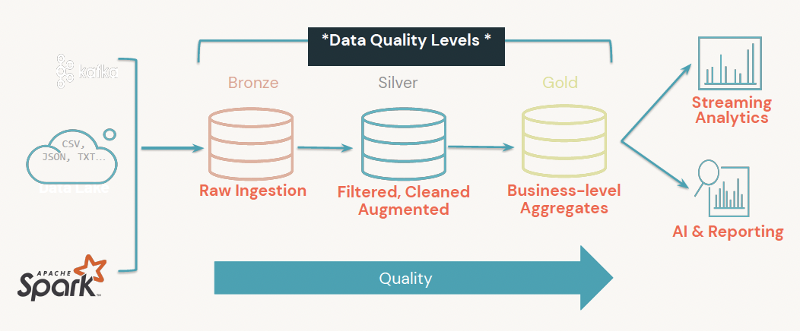

#  Databricks Data Analyst Associate

## Topic 1: Describe Databricks SQL and its capabilities

### <ins>Databricks SQL (users, benefits, queries, dashboards, compute)<ins>

**Users**: 
- Data Analyst
- Data Scientists
- BI Developers: Love working on SQL
- Report Consumers: Minimal technical barriers.

**SQL Analytics Workspace**:
- Simplified Controls
- SQL-Only
- Query Builder & Dashboarding
- Here we are expecting the data store in *Hive Tables*.
- **Check Table of Cluster Size**

**Compute: SQL Endpoint Configuration**
- Name
- Cluster Size
- Auto Stop: Default (120 minutes of inactivity)
- If the cluster is down, someone that run a query will re-launch the cluster
- Multi-Cluster Load Balancing (Min/Max)
- Photon
- Tags

*Monitoring*
- How busy my SQL Endpoint is.

**Query**
- Results can be used in a visualization.
- 1 query can create multiple visualizations.
- You can Format your Query (Ctrl+Shift+F).
- **Refresh Query Schedule**

*Query History*
- Keeping track of who is working on the SQL endpoint and which queries they created.
- Columns: Query | SQL Endpoint | Started At | Duration | User
- You can see the Spark Execution (Spark UI)

**Dashboards**
- Each visualization can be added into a Dashboard.
- Each Dashboard can have multiple queries in it and you can schedule the dashboard.
- If you want to connect your Data to an external BI tool (Power BI), you can get the Server Info from SQL Endpoint/Connection Details.

**Alerts**
- Related to a Query
- Making validation (WHEN column is ... trigger alert)
- Email Template and add Destinations

### <ins>Integrations (Partner Connect, data ingestion, other BI tools)<ins>

**Databricks Partner Connect**

**Dedicated ecosystem of integrations** that allows users to easily connect with popular data ingestion, BI partner products.

- Take less than 6 clicks to make integration.
- No context / page switches.
- **Partner API**: clusters launched automatically.
- If an account doesn't exits -> creates trial account with the technology partner
- What normally requires?: *SQL warehouse endpoint*, *service principal* and *PAT*.

*Requirements*
- Databricks account **Premium** / **Enterprise Plan**
- Databricks worskpace **E2** version
- New connection demands use the workspace admin.
- For Partnr Connect Tasks, use the workspace admin or the user who has at least the workspace access (for SQL the databricks SQL access as well).

*Steps*
1. Allow users to access partner-generated databases and table (*Data Ingestion partners*)
2. Create access token (cloud based: Partner Connect creates the token, desktop-based: use the personal access token from Databricks.)
*Only admins can make token replacement*
Recomendation: create token for service principals not for workspace users.
3. Allow SQL warehouse to access external data.

**Partners for Data Ingestion**: arcion, fivetran, hevo, rivery
**Partners for BI Tools**: Hex, Power BI, preset, sigma, tableau, thoughSpot.

### <ins>Lakehouse (medallion architecture, streaming data)<ins>

**Medallion architecture**


a. Bronze (raw) Layer (INSERT/UPDATE from sources)
- Raw Data with long retention (unvalidated data)
- Avoid error-prone parsing
- Appended
- Batch + Streaming

b. Silver (validated) Layer (DELETE from sources)
- Some cleanup applied (validation and deduplication)
- Queryable
- Joins, filtering and aggregations.

c. Gold (enriched) Layer (MERGE/OVERWRITE)
- Cleaned data, ready for consumption
- Read with Spark or Presto

**Streaming Data**

*Delta Live Tables*
- Manages task orchestration, cluster management, monitoring, data quality and error handling.

*Delta Live Tables Datasets*
| Dataset type       | How are records processed through defined queries?                                                                                                                                                                                  |
|--------------------|-------------------------------------------------------------------------------------------------------------------------------------------------------------------------------------------------------------------------------------|
| Streaming table    | Each record is processed exactly once. This assumes an append-only source (perfect for low-latency demand).                                                                                                                                                          |
| Materialized views (Live Table) | Records are processed as required to return accurate results for the current data state. Materialized views should be used for data sources with updates, deletions, or aggregations, and for change data capture processing (CDC). |
| Views              | Records are processed each time the view is queried. Use views for intermediate transformations and data quality checks that should not be published to public datasets.                                                            |

To process a Delta Live Table Queries you must add all your SQL files into a pipeline.

<ins>Bronze Delta Live Table<ins>

```sql
CREATE OR REFRESH LIVE TABLE clickstream_raw
COMMENT "The raw wikipedia clickstream dataset, ingested from /databricks-datasets."
AS SELECT * FROM json.`/databricks-datasets/wikipedia-datasets/data-001/clickstream/raw-uncompressed-json/2015_2_clickstream.json`;
```

<ins>Silver Delta Live Table<ins>

```sql
CREATE OR REFRESH LIVE TABLE clickstream_prepared(
  CONSTRAINT valid_current_page EXPECT (current_page_title IS NOT NULL),
  CONSTRAINT valid_count EXPECT (click_count > 0) ON VIOLATION FAIL UPDATE
)
COMMENT "Wikipedia clickstream data cleaned and prepared for analysis."
AS SELECT
  curr_title AS current_page_title,
  CAST(n AS INT) AS click_count,
  prev_title AS previous_page_title
FROM live.clickstream_raw;
```

<ins>Gold Delta Live Table<ins>

```sql
CREATE OR REFRESH LIVE TABLE top_spark_referers
COMMENT "A table containing the top pages linking to the Apache Spark page."
AS SELECT
  previous_page_title as referrer,
  click_count
FROM live.clickstream_prepared
WHERE current_page_title = 'Apache_Spark'
ORDER BY click_count DESC
LIMIT 10;
```

*Structured Streaming*
Performs the computation incremenetally and continuosly updates

## Topic 2: Manage data with Databricks tools and best practices

### <ins>Delta Lake (Basics, Benefits)<ins>

**Basics**
- Open Source SW that extends *Parquet* files with a file-based transaction log for **ACID Transactions**

*Ways to ingesting data to Delta Lake*
- Delta Live Tables
- COPY INTO
- Auto Loader
- Add Data UI
- Incrementally/One-time converstion of parquet files to Delta Lake
- Third-party partners

*Updating Delta Lake Tables*
- MERGE support
- Overwriting support

Example 1 (Replace Where clause):
```python
spark.conf.set("spark.databricks.delta.replaceWhere.constraintCheck.enabled", True)

(replace_data.write
  .mode("overwrite")
  .option("replaceWhere", "start_date >= '2017-01-01' AND end_date <= '2017-01-31'")
  .save("/tmp/delta/events")
)
```

Example 2 (Dynamic Partition):
```sql
SET spark.sql.sources.partitionOverwriteMode=dynamic;
INSERT OVERWRITE TABLE default.people10m SELECT * FROM morePeople;
```

- You can manually/automatically update your table schema without rewriting data
- **Column mapping** helps to rename/delete columns without rewriting data

*Incremental and streaming workloads on Delta Lake*
- Table streaming reads and writes
- Using CDF
- Enable idempotent writes

*Query previous versions of a table*
```sql
--check table history
DESCRIBE HISTORY table;

--see a previous version
SELECT * FROM table VERSION AS OF 1;

--restore a table to a previous version
RESTORE TABLE table TO VERSION AS OF 2;
```

*Delta Lake schema enhancements*
- Delta Lake schema validations (columns must exists in target, columns data types must match, column name must match only by case)
- Constraints

```sql
CREATE TABLE people10m (
  id INT NOT NULL,
  firstName STRING,
  middleName STRING NOT NULL,
  lastName STRING,
  gender STRING,
  birthDate TIMESTAMP,
  ssn STRING,
  salary INT
) USING DELTA;

ALTER TABLE people10m ALTER COLUMN middleName DROP NOT NULL;
ALTER TABLE people10m ALTER COLUMN ssn SET NOT NULL;
ALTER TABLE people10m ADD CONSTRAINT dateWithinRange CHECK (birthDate > '1900-01-01');
ALTER TABLE people10m DROP CONSTRAINT dateWithinRange;

--Review constraints
DESCRIBE DETAIL people10m;
SHOW TBLPROPERTIES people10m;
```

- Generated columns
```sql
CREATE TABLE events(
eventId BIGINT,
data STRING,
eventType STRING,
eventTime TIMESTAMP,
year INT GENERATED ALWAYS AS (YEAR(eventTime)),
month INT GENERATED ALWAYS AS (MONTH(eventTime)),
day INT GENERATED ALWAYS AS (DAY(eventTime))
)
PARTITIONED BY (eventType, year, month, day)
```

- Set Custom Metadata
```sql
ALTER TABLE default.people10m SET TBLPROPERTIES ('department' = 'accounting', 'delta.appendOnly' = 'true');

-- Show the table's properties.
SHOW TBLPROPERTIES default.people10m;

-- Show just the 'department' table property.
SHOW TBLPROPERTIES default.people10m ('department');
```

*Managing files and indexing data*
- Z-Order Indexing (technique to colocate related information in the same set of files).
```sql
OPTIMIZE events
WHERE date >= current_timestamp() - INTERVAL 1 day
ZORDER BY (eventType) --common query used column / high cardinality
```
- Compact data files with Optimize
```sql
OPTIMIZE delta.`/data/events`
```
It uses *Bin-packing* optimization (idempotent)
- Remove unused data with Vacuum (**default retention: 7 days**)
Be careful, it only removes data files not log files. This are deleted automatically and asynchronously after checkpoints operations (Default retentation 30 days).
```sql
VACUUM eventsTable   -- vacuum files not required by versions older than the default retention period

VACUUM '/data/events' -- vacuum files in path-based table

VACUUM delta.`/data/events/`

VACUUM delta.`/data/events/` RETAIN 100 HOURS  -- vacuum files not required by versions more than 100 hours old

VACUUM eventsTable DRY RUN    -- do dry run to get the list of files to be deleted
```